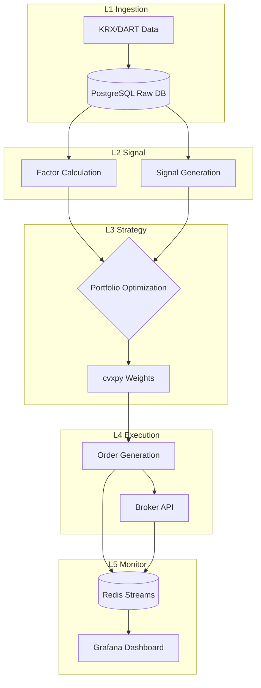

# Quant-Alpha Architecture

이 문서는 5-Layer 퀀트 트레이딩 파이프라인의 전체 데이터 흐름과 의존성을 정의합니다.

## 1. 5-Layer Architecture

## 2. Infrastructure & Data Flow
- **RDBMS**: PostgreSQL (로데이터 및 계좌 메타데이터)
- **OLAP**: DuckDB (백테스트 및 대용량 시계열 분석)
- **Cache / Message Queue**: Redis (실시간 시그널 및 모니터링 이벤트 스트리밍)
- **Orchestration**: Prefect (`@flow`, `@task`를 통한 의존성 스케줄링)

## 3. 핵심 설계 결정 (ADR)
- **KST 강제**: 모든 시계열은 한국 시간(`Asia/Seoul`)을 기준으로 저장.
- **Look-Ahead Bias 차단**: L2 레이어에서 피처 생성 시 무조건 `shift(1)` 이상 적용 필수.
- **Dry-Run 기본값**: L4의 모든 주문 함수는 기본적으로 모의실행(dry-run) 모드로 동작하며, 명시적 승인 후 라이브 전환.
